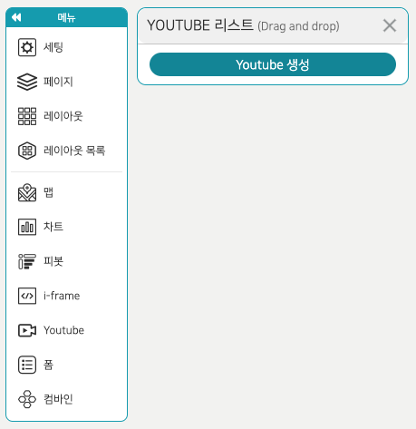
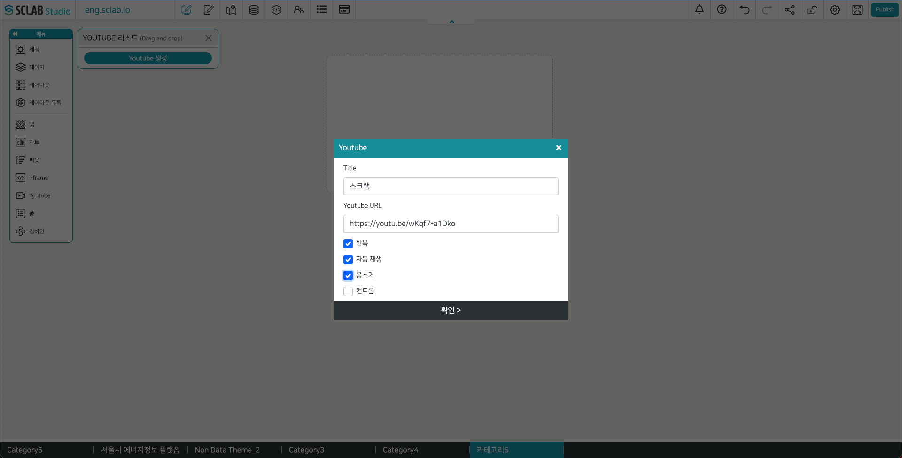

- 현재 연결되어 있는 유투브 리스트가 모두 나타나며 드래그 앤 드롭으로 유투브를 가져올 수 있다. 설정 아이콘을 누르면 해당 유투브를 수정할 수 있다.
- 휴지통 아이콘을 클릭하면 해당 유투브는 삭제되고 레이아웃에 적용된 콘텐츠도 삭제된다.
- 아래 Youtube 생성 버튼을 클릭하여 유투브를 추가할 수 있다.
  

- Title: 유투브 제목을 입력한다.
- Youtube URL: 유투브 인터넷 주소를 입력한다.
- 반복: 유투브가 반복해서 재생된다.
- 자동 재생: 재생 버튼을 누르지 않아도 자동으로 재생된다.
- 음소거: 재생될 때 소리가 제거된 채 재생된다.
- 컨트롤: 체크 해제 시 유투브 아래 재생 조절 및 설정 바가 나타나지 않는다.
  