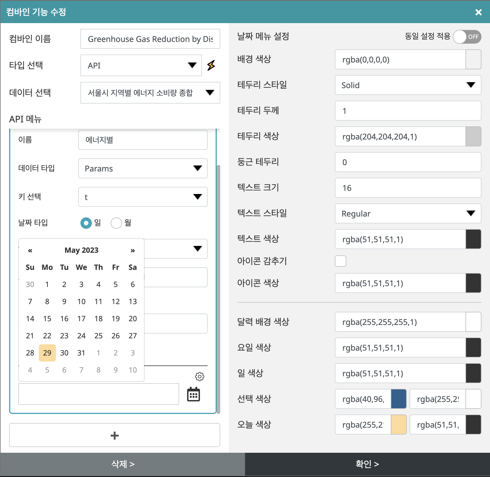

REST API와 연동된 차트에 대한 탭, 드롭다운, 달력 메뉴를 생성하여 동적 데이터 시각화를 생성할 수 있다.
   

컴바인을 생성하려면 ‘컴바인 기능 생성’ 버튼을 클릭하면 컴바인 생성할 수 있는 팝업이 나타난다.
   

- 컴바인 이름을 입력하고 데이터 타입을 선택하면 된다. (현재 API을 지원하고 있다.)
- 컴바인을 만들기 위한 데이터를 선택한다. 데이터는 데이터 편집기에 연동되어 있는 API 데이터들 중에서 선택이 가능하다.
- 하단에 ‘+’ 버튼을 클릭하면 컴바인을 생성할 수 있는 API 메뉴가 나타나고 탭, 드롭다운, 달력을 선택할 수 있는 라디오 버튼 중에 하나를 선택 시 해당 상세 설정을 할 수 있다.
   

## 1.	드롭다운

- 드롭다운 메뉴로 사용할 이름을 입력한다.
- 데이터 타입은 ‘Params’, Headers’, ‘Body’중에 선택한다
- 선택한 데이터의 ‘Key’를 선택한다
- 데이터 선택은 값과 레벨을 수동과 자동으로 선택할 수 있다.
- 데이터 선택을 수동으로 선택 시 수 있으며 수동 선택 시 값과 레벨을 직접 입력한다.
- 데이터 선택을 자동으로 선택 시 값과 레벨을 자동으로 연동할 수 있는 데이터를 선택한다.
- 데이터를 선택 및 입력 후 하단에 드롭 다운을 미리 확인 할 수 있다.
- 하단에 +버튼을 클릭하면 같은 데이터로 다른 방식의 컴바인 메뉴를 추가할 수 있다.
- 드롭 다운메뉴 오른쪽 상단에 설정버튼을 클릭하면 드롭 다운 메뉴의 디자인을 설정할 수 있다.
- 설정을 완료하면 하단에 확인 버튼을 클릭하면 컴바인 목록에 추가된다.
- 삭제 시 해당 컴바인을 클릭하고 하단에 삭제 버튼을 클릭하면 삭제된다.
   

- 드롭다운 메뉴 설정영역으로 기본 제공하는 드롭 다운 이외에서 사용자가 원하는 디자인으로 설정할 수 있다. 
- 메뉴스타일: 기본, 투명, 화이트, 다크 스타일중에서 선택
- 화살표 색상: 화살표 드롭다운 버튼의 컬러를 블랙, 그레이, 화이트 중에서 선택
- 배경 색상: 배경컬러를 설정
- 테두리 스타일: 테두리 스타일을 없음, 실선, 점선, 점 중에서 선택
- 테두리 두께: 테두리의 두께를 입력하여 설정
- 테두리 색상: 테두리의 컬러를 설정
- 둥근 테두리: 모서리의 둥근 정도를 입력하여 설정
- 텍스트 크기: 텍스트를 입력하여 설정하며 크기에 따라서 드롭 다운의 두께도 달라짐 
- 텍스트 스타일: 텍스트의 스타일을 Light, Regular, Bold, Black, Light Italic, Regular Italic, Bold Italic, Black Italic 중에서 선택
- 텍스트 색상: 텍스트의 컬러를 설정
- 배경 색상: 드롭 다운의 배경컬러를 설정
- 테두리 스타일: 드롭 다운의 테두리 스타일을 없음, 실선, 점선, 점 중에서 선택
- 테두리 두께: 드롭 다운의 테두리의 두께를 입력하여 설정
- 테두리 색상: 드롭 다운의 테두리의 컬러를 설정
- 둥근 테두리: 드롭 다운의 모서리의 둥근 정도를 입력하여 설정
- 텍스트 크기: 드롭 다운의 텍스트를 입력하여 설정하며 크기에 따라서 드롭 다운의 두께도 달라짐 
- 텍스트 스타일: 드롭 다운의 텍스트의 스타일을 Light, Regular, Bold, Black, Light Italic, Regular Italic, Bold Italic, Black Italic 중에서 선택
- 텍스트 색상: 드롭 다운의 텍스트의 컬러를 설정
- 같은 데이터에서 다수의 컴바인을 생성할 때 메뉴 설정 오른쪽 상단에 동일 설정 적용하면 상단에 적용된 설정값을 동일하게 적용된다.
   

## 2.	탭

- 탭으로 사용할 이름을 입력한다.
- 데이터 타입은 ‘Params’, Headers’, ‘Body’중에 선택한다
- 선택한 데이터의 ‘Key’를 선택한다
- 데이터 선택은 값과 레벨을 수동과 자동으로 선택할 수 있다.
- 데이터 선택을 수동으로 선택 시 수 있으며 수동 선택 시 값과 레벨을 직접 입력한다.
- 데이터 선택을 자동으로 선택 시 값과 레벨을 자동으로 연동할 수 있는 데이터를 선택한다.
- 데이터를 선택 및 입력 후 하단에 탭을 미리 확인 할 수 있다.
- 하단에 +버튼을 클릭하면 같은 데이터로 다른 방식의 컴바인 메뉴를 추가할 수 있다.
- 탭 메뉴 오른쪽 상단에 설정버튼을 클릭하면 탭의 디자인을 설정할 수 있다.
- 설정을 완료하면 하단에 확인 버튼을 클릭하면 컴바인 목록에 추가된다.
- 삭제 시 해당 컴바인을 클릭하고 하단에 삭제 버튼을 클릭하면 삭제된다.
   

- 탭 메뉴 설정영역으로 기본 제공하는 탭 이외에서 사용자가 원하는 디자인으로 설정할 수 있다. 

### 탭, 버튼 스타일
- 메뉴 스타일: 탭, 버튼, 라인 스타일 중에서 선택
- 탭 색상: Active, Normal 상태의 색상을 설정
- 탭 둥근 테두리: Top_L, Top_R, Bottom_R, Bottom_L의 각 모서리의 둥근 값을 입력하여 설정
- 탭 간격: 각 탭들 간의 간격을 입력하여 설정 
- 테두리 스타일: Active, Normal 상태의 색상을 설정
- 테두리 두께: Active, Normal 상태의 테두리의 두께를 입력하여 설정
- 테두리 색상: Active, Normal 상태의 테두리의 컬러를 설정
- 텍스트 스타일: Active, Normal 상태의 텍스트 스타일을 Light, Regular, Bold, Black, Light Italic, Regular Italic, Bold Italic, Black Italic 중에서 선택
- 텍스트 색상: Active, Normal 상태의 텍스트 컬러를 설정
- 텍스트 크기: 텍스트 크기를 입력하여 설정
- 탭 아이콘: 만들어진 탭에 개수에 따라 Active, Normal 상태의 아이콘을 생성
- 아이콘 위치: 탭 아이콘의 위치를 Left, Right, Top, Bottom 중에서 선택 
- 같은 데이터에서 다수의 컴바인을 생성할 때 메뉴 설정 오른쪽 상단에 동일 설정 적용하면 상단에 적용된 설정값을 동일하게 적용된다.
 

### 라인 스타일
- 메뉴 스타일: 탭, 버튼, 라인 스타일 중에서 선택
- 탭 간격: 각 탭들 간의 간격을 입력하여 설정 
- 라인 스타일: Active, Normal 상태의 라인 스타일을 없음, 실선, 점선, 점 중에서 선택 
- 라인 두께: Active, Normal 상태의 라인의 두께를 입력하여 설정
- 라인 색상: Active, Normal 상태의 라인의 컬러를 설정
- 텍스트 스타일: Active, Normal 상태의 텍스트 스타일을 Light, Regular, Bold, Black, Light Italic, Regular Italic, Bold Italic, Black Italic 중에서 선택
- 텍스트 색상: Active, Normal 상태의 텍스트 컬러를 설정
- 텍스트 크기: 텍스트 크기를 입력하여 설정
- 탭 아이콘: 만들어진 탭에 개수에 따라 Active, Normal 상태의 아이콘을 생성
- 아이콘 위치: 탭 아이콘의 위치를 Left, Right, Top, Bottom 중에서 선택 
- 같은 데이터에서 다수의 컴바인을 생성할 때 메뉴 설정 오른쪽 상단에 동일 설정 적용하면 상단에 적용된 설정값을 동일하게 적용된다.
  

## 3.	달력

- 달력으로 사용할 이름을 입력한다.
- 데이터 타입은 ‘Params’, Headers’, ‘Body’중에 선택한다
- 선택한 데이터의 ‘Key’를 선택한다
- 데이터의 타입을 일, 월 중에 선택한다.
- 달력에서 사용할 언어를 선택한다.
- 달력의 기본 포맷을 입력한다. 예를 들어 dd/mm/yyyy, yyyy-mm-dd으로 입력하거나 타임 스탬프를 체크하면 기본 포맷으로 표시된다.
- 달력에 표시될 기본 날짜를 입력하거나 오늘을 체크하면 오늘로 표시된다. 
- 하단에 달력을 미리 확인 할 수 있다.
- 하단에 +버튼을 클릭하면 같은 데이터로 다른 방식의 컴바인 메뉴를 추가할 수 있다.
- 달력의 오른쪽 상단에 설정버튼을 클릭하면 달력의 디자인을 설정할 수 있다.
- 설정을 완료하면 하단에 확인 버튼을 클릭하면 컴바인 목록에 추가된다.
- 삭제 시 해당 컴바인을 클릭하고 하단에 삭제 버튼을 클릭하면 삭제된다.
   

- 달력 설정영역으로 사용자가 원하는 디자인으로 설정할 수 있다. 
- 배경 색상: 배경 컬러를 설정
- 테두리 스타일: 테두리 스타일을 없음, 실선, 점선, 점 중에서 선택
- 테두리 두께: 테두리의 두께를 입력하여 설정
- 테두리 색상: 테두리의 컬러를 설정
- 둥근 테두리: 모서리의 둥근 정도를 입력하여 설정
- 텍스트 크기: 텍스트를 입력하여 설정
- 텍스트 스타일: 텍스트의 스타일을 Light, Regular, Bold, Black, Light Italic, Regular Italic, Bold Italic, Black Italic 중에서 선택
- 텍스트 색상: 텍스트의 컬러를 설정
- 아이콘 감추기: 달력 아이콘을 감추고 달력영역을 넓힘
- 아이콘 색상: 달력 아이콘의 컬러를 설정
- 달력 배경 색상: 달력 배경 컬러를 설정
- 요일 색상: 달력의 요일 컬러를 설정
- 일 색상: 달력의 일별 컬러를 설정
- 선택 색상: Active, Normal 상태의 선택된 달력의 컬러를 설정
- 오늘 색상: Active, Normal 상태의 오늘 컬러를 설정
- 같은 데이터에서 다수의 컴바인을 생성할 때 메뉴 설정 오른쪽 상단에 동일 설정 적용하면 상단에 적용된 설정값을 동일하게 적용된다.
   

<iframe width="100%" height="640" src="https://www.youtube.com/embed/ZTcO_Gdhtmk?start=684" title="YouTube video player" frameborder="0" allow="accelerometer; autoplay; clipboard-write; encrypted-media; gyroscope; picture-in-picture; web-share" allowfullscreen></iframe>

  