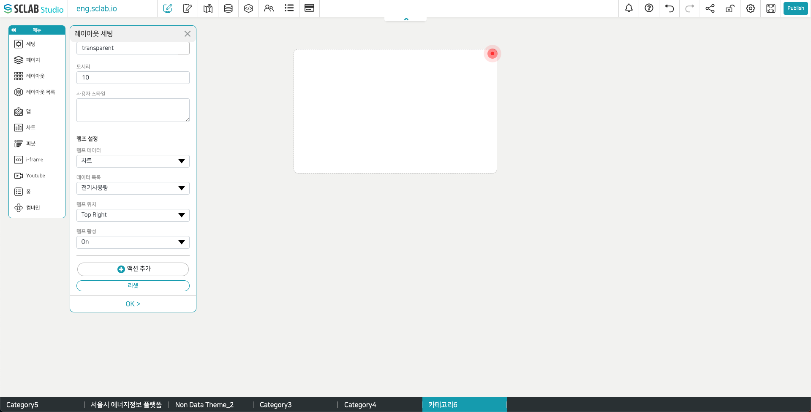

- 램프 데이터/데이터 목록: 램프 알람의 기준이 되는 데이터를 선택한다. 각각의 차트나 위치를 만들 때 설정했던 임계치 기준과 색상에 따라 램프의 색상이 다르게 적용된다.
데이터 값이 바뀜에 따라 다른 색상의 기준에 해당된다면 색상이 변화할 수 있다.
- 램프 데이터를 위치로 설정한 경우에는 데이터를 행별로 체크해 나가다 처음 임계치가 확인된 색상값이 노출된다.
- 램프 위치: 램프가 깜박이는 위치를 지정한다.
- 램프 활성: ON의 경우 해당 조건을 만족시키면 설정한 위치에서 램프가 깜빡인다.
  