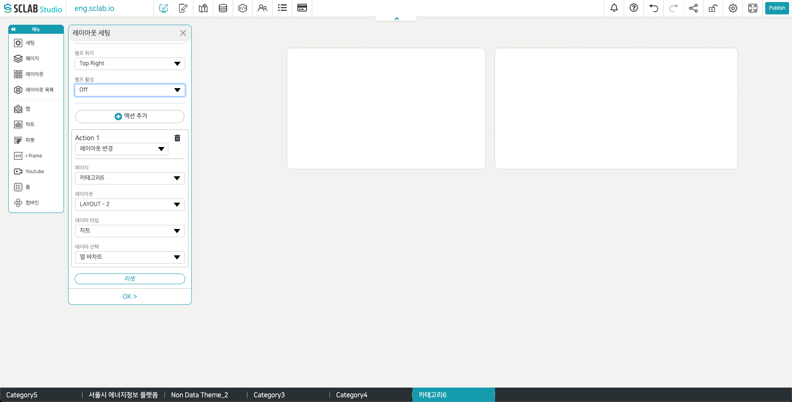

- 해당 레이아웃 클릭 시 설정한 액션이 적용된다. 동시에 실행되기 어려운 액션이 여러가지 추가되었을 경우에는 화면 상 가장 위에 적용된 액션이 실행된다.
- 레이아웃 변경: 설정한 페이지에 있는 레이아웃 위치에 설정한 데이터가 적용된다.
- 위치 이동: 선택한 맵의 선택한 위치로 이동한다. 위치 선택 아래 아이콘을 클릭하고 커서를 선택하여 위도와 경도를 지도 위에서 설정할 수도 있다.
- 링크: 설정한 페이지로 이동하거나 인터넷 주소를 입력하여 설정한 인터넷 주소를 띄울 수도 있다. 현재 페이지나 새 창에 링크를 적용시킬 수 있다.
- 추후 데이터를 붙여 넣을 수 있는 레이아웃 구성을 아래 예시처럼 만들어 보자.
  