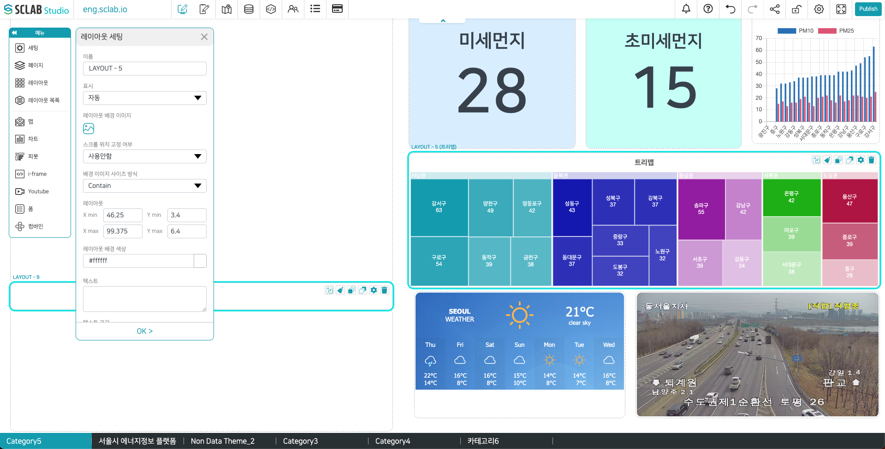

- 이름: 레이아웃의 이름을 설정
- 표시
⬝ 자동으로 선택: 데이터가 없고 레이아웃 배경에 색만 있는 경우에는 공개된 화면에서 나타나지 않는다. 데이터가 있으면(텍스트, 배경 이미지도 해당) 공개된 화면에서 보인다.
⬝ 보이기로 선택: 데이터 유무에 관계없이 공개된 화면에서 보여 진다.
⬝ 숨기기로 선택: 공개된 화면에서는 보이지 않는다.
- 스크롤 위치 고정 여부: 사용함은 해당 페이지 화면을 스크롤로 내려도 레이아웃은 그대로 고정되어 나타난다. 사용 안함은 스크롤로 내릴 때 레이아웃이 고정되지 않는다.
- 배경 이미지 사이즈 방식: Contain으로 선택하면 원래 이미지 그대로 들어갈 수 있게 이미지 가로 세로 사이즈 비율도 원래 이미지와 같게 해당 레이아웃 칸에 추가된다. 빈공간이 생길 수 있다. Cover로 선택하면 레이아웃 전체를 덮을 수 있도록 이미지가 조정되어 표현된다. 이미지와 레이아웃의 가로 세로 비율이 다르면 이미지 전체가 나타나지 않을 수 있다.
- 레이아웃: 레이아웃 사각형 영역의 크기와 위치를 지정해 준다. 아래 이미지로 예를 들면 X min 35.625 Y min 30 은 페이지에서 (X축 좌표, Y축 좌표) (35.625, 30) 이라고 생각하면 된다. 이 위치에 점을 찍어줬다고 생각하자.
X max 54.375 Y max 67의 경우에는 같은 페이지 (54.375, 67) 위치에 다른 점도 하나 더 찍었다고 생각하자.
  

- 화면에 표시된 빨간 점 두개를 대각선으로 연결하는 사각형이 설정된 레이아웃의 영역이다.
- 레이아웃의 배경 색상: 레이아웃의 전체 배경의 색상과 투명도를 설정
- 텍스트: 레이아웃 안에 표시할 텍스트
- 텍스트 크기: 레이아웃에 들어가는 텍스트의 크기
- 텍스트 색상: 레이아웃에 들어가는 텍스트 색상, 투명도
- 텍스트 스타일: Light, Regular, Bold, Black (텍스트 두께)
- 텍스트 위치: 레이아웃 영역에서 텍스트의 위치
- 텍스트 정렬: 왼쪽/가운데/오른쪽/양쪽 정렬
- 레이아웃 투명도: 레이아웃에 들어가 있는 전체 데이터/배경 이미지/텍스트/의 투명도가 한 번에 적용
- 여백: 레이아웃 영역에서 테두리 안에 데이터/배경 이미지/텍스트 가 채워질 때 설정된 여백만큼 비워 두고 채워진다.
- 간격: 레이아웃 영역에서 설정된 간격만큼 제외하고 테두리가 시작된다.
- 테두리 스타일: 다양한 테두리 종류 선택
- 테두리 넓이: 테두리 두께
- 테두리 색상: 테두리 색상, 투명도
- 모서리: 숫자가 클수록 원에 가까워진다.
- 사용자 스타일: 따로 코드 같은 것을 넣어줄 수 있다.
  

