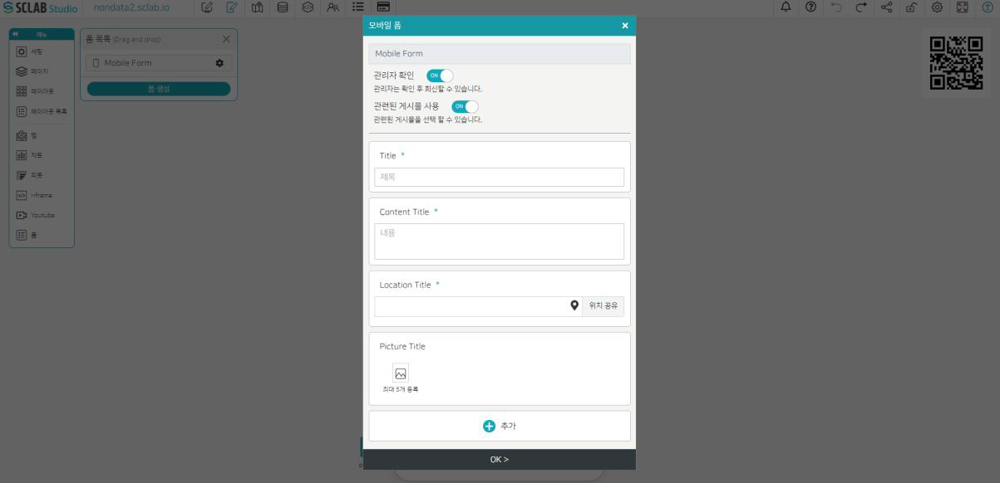
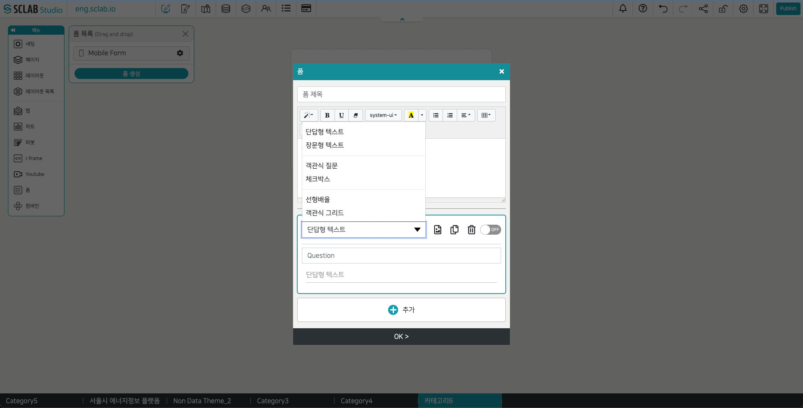
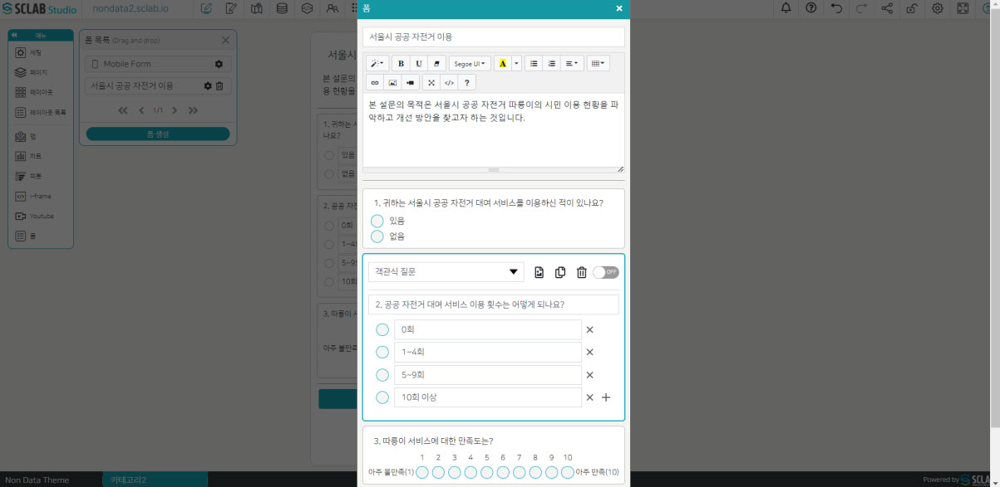
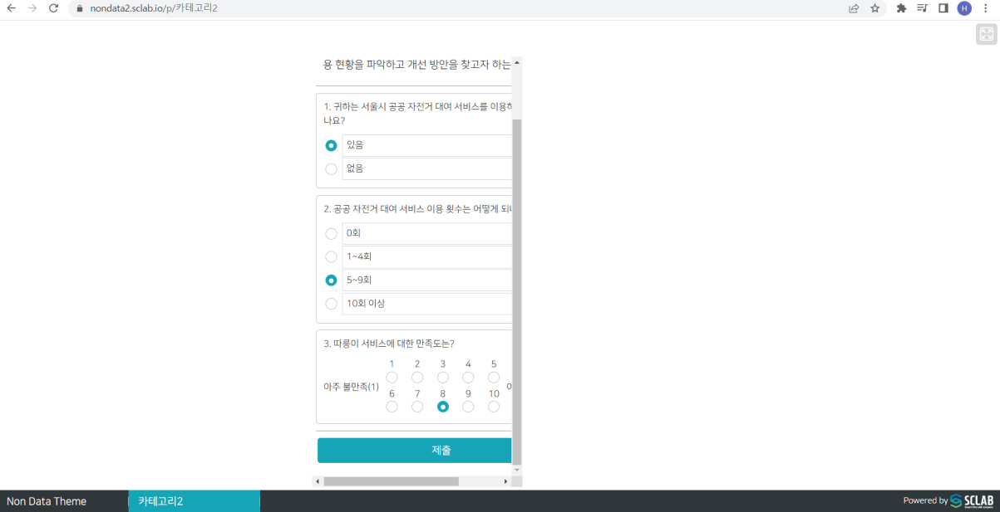
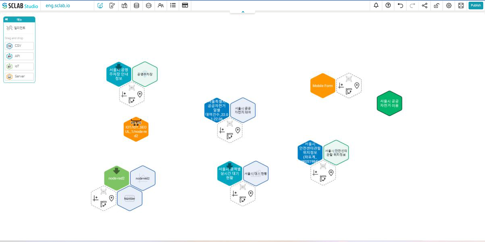
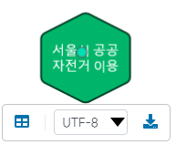

## 모바일 폼
- Mobile Form은 기본으로 제공되며 포스팅으로 신고하기로 쓸 수 있다. 모바일 폼은 모바일에서만 사용 가능하다.
- Mobile Form 오른쪽 설정 버튼을 클릭하면 아래와 같은 팝업이 뜬다.

- 관리자 확인: on을 선택하면 관리자가 포스팅 확인 후 회신할 수 있다.
- 관련된 게시물 사용: on을 선택하면 모바일에서 포스트를 작성할 때 기존에 작성했던 다른 게시물도 연관 게시물로 선택할 수 있다.
- 제목 라벨: 포스트의 제목과 관련된 문구를 정할 수 있다. 제목라벨 밑에 제목 부분은 포스트 작성자가 나중에 작성하는 부분으로 해당 포스트의 제목을 정하게 된다. 이미지가 필요하다면 추가할 수 있다. 제목 라벨은 복사 불가능하다. 제목라벨은 필수이기 때문에 항상 보여야 하므로 off(안보이기) 선택 불가이다.
- 내용 라벨: 포스트의 내용과 관련된 문구를 정할 수 있다. 내용라벨 밑에 내용 부분은 포스트 작성자가 나중에 작성하는 부분으로 해당 포스트의 제목과 관련된 상세 내용을 작성하게 된다. 이미지가 필요하다면 추가할 수 있다. 내용 라벨은 복사 불가능하다. 내용라벨은 필수이기 때문에 항상 보여야 하므로 off(안보이기) 선택 불가이다.
- Location Title: 포스트의 위치와 관련된 문구를 정할 수 있다. 위치 타이틀 밑에 포스팅 작성자가 지도에서 선택하여 위치를 설정하게 된다. 이미지가 필요하다면 추가할 수 있다. 지도에서 핀마크로 사용할 이미지 또한 추가할 수 있다. Location Title 은 복사 불가능하다. Location Title은 필수이기 때문에 항상 보여야 하므로 off(안보이기) 선택 불가이다.
- Picture Title: 이미지와 타이틀을 추가할 수 있다. 안보이기 선택 가능하지만 복사는 불가하다.
- Picture Title 아래 추가 버튼을 클릭하면 다양한 종류의 라벨을 추가할 수 있다. 이는 모두 복사, 삭제, 안보이게 하기 가능하다.
- 단답형 텍스트 라벨: 단답형 텍스트 라벨 밑에 포스트 작성자가 단답형 텍스트를 추가할 수 있다.
- 장문형 텍스트 라벨: 장문형 텍스트 라벨 밑에 포스트 작성자가 장문형 텍스트를 추가할 수 있다.
- 카테고리: 카테고리를 설정하면 포스트 작성자가 해당 카테고리 중 하나를 골라서 선택할 수 있다.
- 링크 라벨: 링크 라벨 밑에 포스트 작성자가 링크를 추가할 수 있다.
- 유투브 라벨: 유투브 라벨 밑에 포스트 작성자가 유투브 링크를 추가할 수 있다.
- 날짜: 해당 포스트와 관련된 날짜를 입력하게 할 수 있다.
- 시간: 해당 포스트와 관련된 시간을 입력하게 할 수 있다.
- 원하는 내용으로 Mobile Form을 구성한 뒤에 OK 버튼을 눌러 저장해 주자. 추후 모바일에서 사람들이 접속하여 이 양식을 이용하여 포스트를 작성하게 된다.
  

## 폼 만들기
- 폼 목록에 있는 폼 생성 버튼을 클릭하면 아래와 같은 팝업이 뜬다.

- 폼 제목을 적고 폼에 관련된 설명을 스타일, 폰트, 글씨체, 정렬 등의 기능을 이용해서 작성한다. 필요하면 표나 이미지 링크, 영상 추가도 가능하다.
- 아래 추가 버튼을 이용하여 다양한 형식의 질문을 추가할 수 있다.
- 단답형 텍스트: 응답자의 단답형 대답을 원하는 경우
- 장문형 텍스트: 응답자의 장문형 대답을 원하는 경우
- 객관식 질문: 객관식 질문 추가
- 체크박스: 체크박스 형 질문 추가
- 선형배율: 선호도나 호감도와 같이 단계별 정도에 따라 답변을 요구할 때 사용한다.
- 객관식 그리드: 선택지를 격자모양으로 제시. 한 질문에 대한 응답이 다양한 항목으로 구분될 때 사용하면 좋다.
- 체크박스 그리드: 객관식 그리드와 비슷하지만 복수 응답이 가능하다는 점이 다르다.
- 날짜, 시간: 날짜 및 시간을 묻고 싶을 때
- 파일 업로드: 파일 업로드를 요청하고 싶을 때
- 작성 완료 후 OK 버튼을 누르면 폼 목록에 추가된다.
- 추후에 폼 목록에서 선택하여 레이아웃 영역에 드래그 앤 드롭하고 발행을 하게 되면 해당 사이트에 접속 시 해당 폼이 나타나게 된다. 폼에 답하고 제출을 누르면 저장되었습니다. 라고 뜨고 확인은 관리자가 데이터 페이지에서 확인하고 다운도 받을 수 있다.
- 폼 양식을 이용해 샘플로 설문 조사폼을 작성해 보자.
  

- OK 버튼을 누르고 저장 후 페이지 편집기에서 레이아웃 영역을 설정하자.
- 그리고 폼 목록에서 방금 작성한 설문 조사를 찾아서 아래처럼 드래그 앤 드롭해 보자.
  

- 오른쪽 위 발행하기 버튼을 눌러 준다.
- 왼쪽 위에 nondata2.sclab.io 버튼을 클릭하면 새 창이 뜨고 새창에서 해당 페이지에 접속하면 사람들에게 페이지가 어떻게 보여지는지 확인할 수 있다.
  

- 해당되는 항목을 선택해 주고 제출 버튼을 클릭하자.
- 사람들이 이렇게 하나씩 작성하여 제출 버튼을 클릭한 데이터는 관리자 페이지에서 확인이 가능하다.
- 데이터 편집기에 새로운 녹색 육각형이 추가된 것을 볼 수 있다.
  

## 폼 데이터

- 육각형을 클릭하면 위 그림처럼 나타난다.
- 왼쪽 사각형을 클릭하면 상세 데이터를 볼 수 있다.
- 가운데 인코딩 형식을 선택하고 오른쪽 다운로드 버튼을 통해 데이터를 다운받을 수 있다.
  