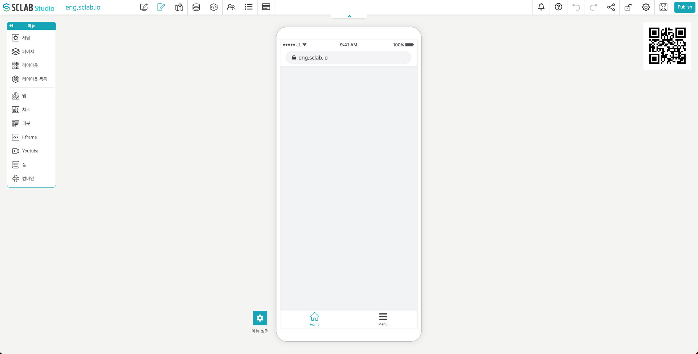
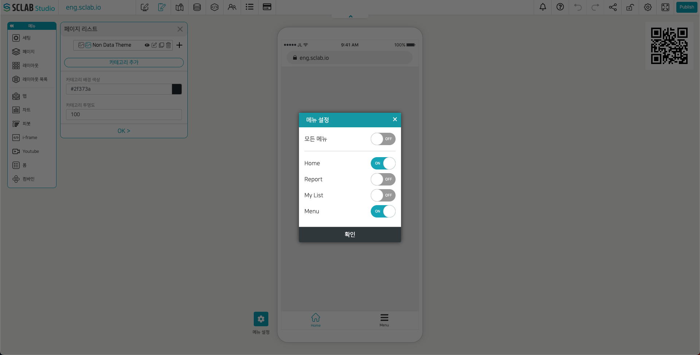
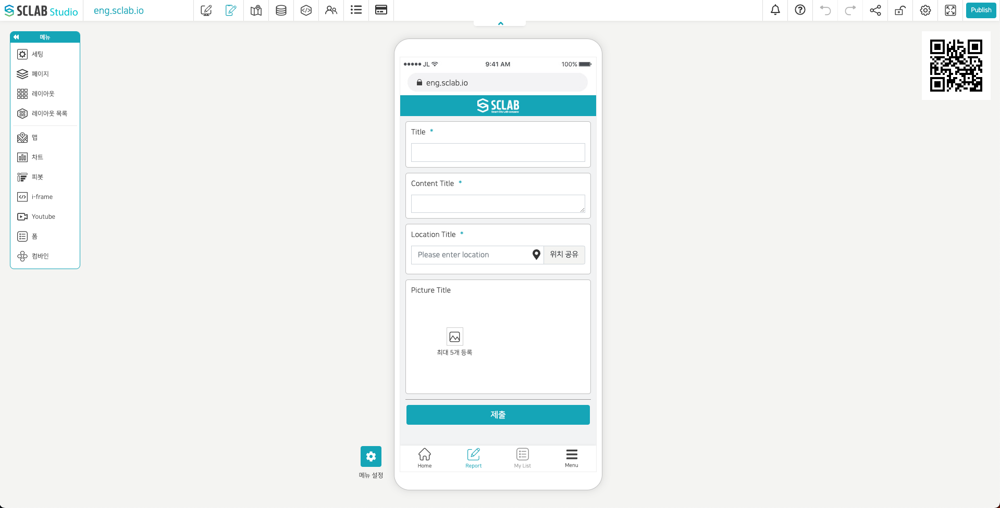
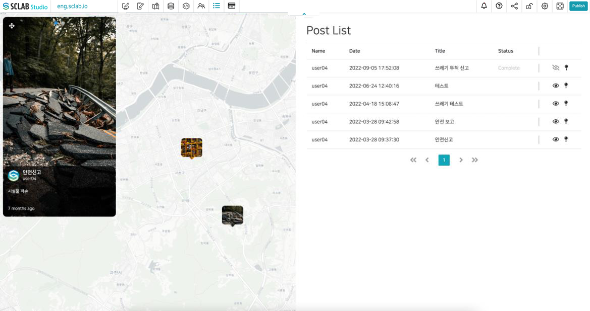

## Mobile editor

- 모바일 편집기는 웹에서 쓰이는 페이지 편집기와 구성은 동일하다.
- 모바일 주소 및 모바일 화면에서 보여지는 콘텐츠를 구성할 수 있다.
- 오른쪽 QR을 다운받아 공공장소 및 필요한 장소에 부착하여 모바일로 접속할 수 있다.
  

## Mobile Menu setting

- 모바일에 나타나는 메뉴를 설정할 수 있다.
- Home: 메인 페이지
- Report: 이 메뉴를 보이도록 설정하면 모바일에서 포스트를 작성할 수 있다.
- My List: 내가 작성한 포스트 목록을 볼 수 있다.
- Menu: 모바일에서 이 항목을 클릭하면 현재 구성된 페이지 목록을 볼 수 있다. 
  

## Mobile page setting

- 왼쪽 페이지 메뉴를 클릭하여 페이지 리스트에서 페이지를 추가해 주면 모바일 페이지를 추가하여 구성할 수 있다.
  

## Mobile report

- 앞서 폼에서 설명했듯이 Mobile Form에서 모바일 포스트 폼 구성 방식을 셋팅한 후 발행하기를 통해 공유해 주면 모바일에서 Report 메뉴로 들어가 포스트를 작성할 수 있다.
   

- 안전 시설물 관리 신고 및 보고하기, 시민들의 도시 환경 신고하기, 모바일 사용자들의 포스팅 등 다양한 디지털 콘텐츠 활용이 가능하다.
- 위 모바일 편집기 오른쪽에 있는 QR 코드를 이용해 모바일로 접속하자.
- 아래 메뉴에서 Report를 클릭하고 포스트를 하나 작성해 보기로 한다.
- Title은 쓰레기 신고, Content Title은 불법 쓰레기 투척 목격. 으로 적고 Location Title에서 위치 버튼을 클릭하여 위치를 선택한 뒤 위치 공유 버튼을 클릭한다. 이미지를 사진첩에서 하나 추가하고 제출 버튼을 누르자.
  

- 모바일에서 포스트 작성 후 제출 버튼을 클릭하면 웹 관리자 화면에서 모바일 사용자가 제출한 포스트가 실시간으로 노출된다(사진, 제목, 내용 모두)
- Mobile Form 작성 시 관리자 확인에 ON 체크하면 모바일 사용자가 포스트 제출시 웹관리자의 웹 포스트 목록에 새 알림 표시가 뜨며 빨간색 수령 버튼을 누르면 작성자에게 메시지를 보낼 수 있으며 응답 시 상태는 완료로 바뀐다. 관리자가 응답하면 모바일로 관리자의 응답 메시지를 확인 가능하다.
- 눈모양 아이콘을 클릭하여 해당 포스트를 지도에서 안보이게 할 수 있고, 핀모양 아이콘을 클릭하여 해당 위치를 저장할 수도 있다.
  