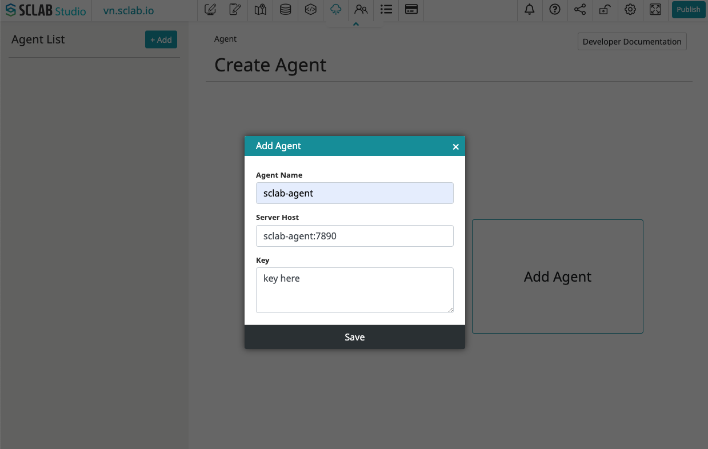
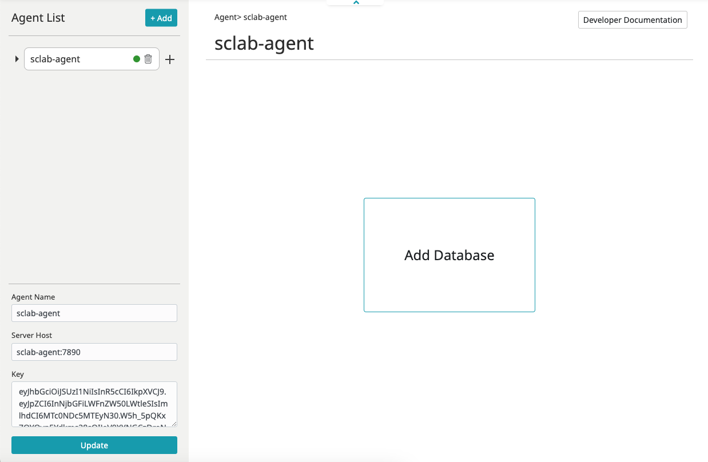

## 소개
SCLAB DB 에이전트를 이용해서 데이터 베이스에 쉽게 연결하세요.

## 기능
- MySQL
- PostgreSQL
- SQL Server
- Oracle
- SAP HANA
- Presto/Trino
- ODBC
- SQL 쿼리를 사용하여 일정 간격으로 MQTT 메시지 발행하기
- SQL 쿼리로 REST API 엔드포인트 생성하기
- HTTP 인증을 위한 JWT
- 결과 데이터를 JSON 형식으로 처리하기
- SQL Injection 차단 (기본 on)
- Mybatis 매핑
- AI SQL 쿼리 생성기

## 설치방법

### 준비사항
- docker 설치
- 데이터 베이스 접속 정보

### SCLAB DB 에이전트 설치
https://hub.docker.com/r/sclabio/sclab-agent

### SCLAB DB 에이전트를 컨텐츠 사이트에 추가하기

